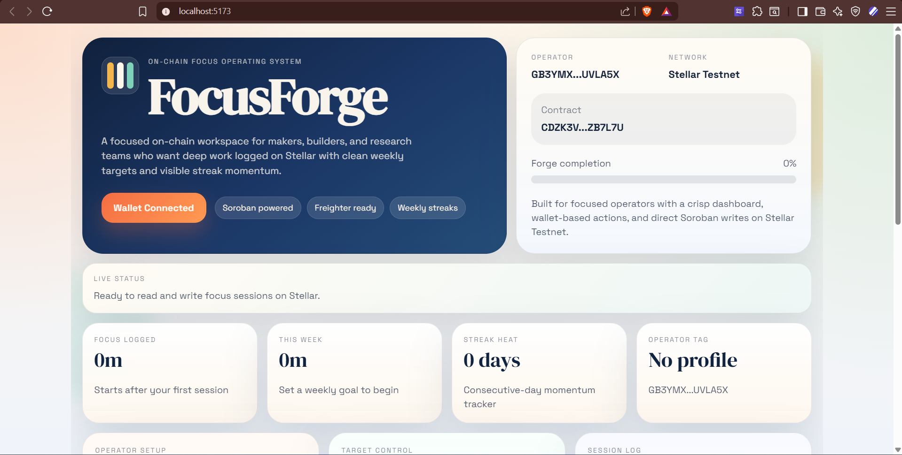

# FocusForge

FocusForge is a Stellar Soroban mini-dApp for tracking deep-work time on-chain. Operators connect a Freighter wallet, create a public profile, set a weekly focus target, and log individual work sessions that update weekly progress and streak data.

## Submission Links

- Demo recording: [screenrecord.mp4](./screenrecord.mp4)
- Stellar Lab contract page: `https://lab.stellar.org/r/testnet/contract/CDZK3VVCOAHLHSVLOGI3IC3SKGTOL5SGNY2I42LN26EUHJUKLFZB7L7U`
- Testnet transaction 1: `https://stellar.expert/explorer/testnet/tx/94db57b61c4550ca5f7a214cbaa66715f60de87a3278a7d8179669c52011e5a5`
- Testnet transaction 2: `https://stellar.expert/explorer/testnet/tx/a8102bb5301718e04ab29082ac40ea4b828259c22ab7a7ad5282d3f91050571a`

## UI Preview



## Demo Recording

<video src="./screenrecord.mp4" controls width="100%"></video>

## Deployment Details

- Network: `Stellar Testnet`
- Contract alias: `focus_forge`
- Contract ID: `CDZK3VVCOAHLHSVLOGI3IC3SKGTOL5SGNY2I42LN26EUHJUKLFZB7L7U`
- Contract explorer: `https://lab.stellar.org/r/testnet/contract/CDZK3VVCOAHLHSVLOGI3IC3SKGTOL5SGNY2I42LN26EUHJUKLFZB7L7U`
- Testnet transaction 1: `https://stellar.expert/explorer/testnet/tx/94db57b61c4550ca5f7a214cbaa66715f60de87a3278a7d8179669c52011e5a5`
- Testnet transaction 2: `https://stellar.expert/explorer/testnet/tx/a8102bb5301718e04ab29082ac40ea4b828259c22ab7a7ad5282d3f91050571a`

## What The App Does

Users can:

- Connect a Freighter wallet on Stellar Testnet
- Create or update a public operator profile
- Set a weekly focus target
- Log deep-work sessions on-chain
- Track total minutes, weekly progress, and streaks
- Review recent sessions pulled from the deployed contract

## Stack

- Smart contract: Rust + Soroban SDK
- Contract tooling: Stellar CLI
- Frontend: React + Vite
- Wallet: Freighter
- Network access: Soroban RPC via `@stellar/stellar-sdk`
- Data fetching: TanStack Query

## Project Structure

```text
contracts/focus_forge/
frontend/
scripts/
Cargo.toml
package.json
README.md
```

## Contract Features

The Soroban contract stores:

- An operator profile per Stellar address
- Individual focus sessions by index
- Weekly progress totals
- Consecutive-day streaks

Contract methods:

- `save_profile(learner, display_name, weekly_goal_minutes)`
- `update_weekly_goal(learner, new_goal_minutes)`
- `log_session(learner, topic, minutes_spent)`
- `get_dashboard(learner)`
- `get_session_count(learner)`
- `get_session(learner, index)`
- `has_profile(learner)`

Validation rules:

- Display name: 3 to 32 chars
- Topic: 3 to 48 chars
- Session length: 5 to 480 minutes
- Weekly goal: 30 to 5000 minutes

## Local Setup

### 1. Install dependencies

```powershell
npm install
```

### 2. Run contract tests

```powershell
npm run contract:test
```

### 3. Build the Soroban contract

```powershell
npm run contract:build
```

This uses `stellar contract build` and outputs:

```text
target/wasm32v1-none/release/focus_forge.wasm
```

### 4. Configure environment

Copy `.env.example` to `.env` and set a Stellar CLI identity:

```env
STELLAR_ACCOUNT=alice
STELLAR_NETWORK=testnet
STELLAR_CONTRACT_ALIAS=focus_forge
VITE_STELLAR_RPC_URL=https://soroban-testnet.stellar.org
VITE_STELLAR_NETWORK_PASSPHRASE=Test SDF Network ; September 2015
VITE_CONTRACT_ID=
```

For this deployed testnet instance, you can set:

```env
VITE_CONTRACT_ID=CDZK3VVCOAHLHSVLOGI3IC3SKGTOL5SGNY2I42LN26EUHJUKLFZB7L7U
```

## Deploy To Stellar Testnet

### 1. Create and fund a testnet identity

Using Stellar CLI:

```powershell
stellar keys generate alice --network testnet --fund
```

This follows the current Stellar docs flow for testnet deployment with `stellar` CLI.

### 2. Build the contract

```powershell
npm run contract:build
```

### 3. Deploy the contract

```powershell
npm run contract:deploy
```

The deploy script wraps:

```powershell
stellar contract deploy `
  --wasm target/wasm32v1-none/release/focus_forge.wasm `
  --source-account alice `
  --network testnet `
  --alias focus_forge
```

After deployment it writes:

```text
deployments/testnet.json
```

Current deployed record:

- Source account alias: `alice`
- Contract ID: `CDZK3VVCOAHLHSVLOGI3IC3SKGTOL5SGNY2I42LN26EUHJUKLFZB7L7U`
- Deployment timestamp: `2026-04-21T14:48:17.511Z`

### 4. Export frontend config

```powershell
npm run export:frontend
```

That updates:

```text
frontend/src/lib/contract-config.js
```

### 5. Start the frontend

```powershell
npm run dev
```

Then open the Vite URL and connect Freighter on `Stellar Testnet`.

## Production Build

```powershell
npm run build
```

This will:

1. Build the Soroban contract
2. Export the frontend config
3. Build the React app into `frontend/dist`

## Vercel Deployment

The repo is still Vercel-ready for the frontend.

- Install command: `npm install`
- Build command: `npm run build`
- Output directory: `frontend/dist`

Set these Vercel environment variables:

- `VITE_STELLAR_RPC_URL`
- `VITE_STELLAR_NETWORK_PASSPHRASE`
- `VITE_CONTRACT_ID`

Recommended testnet values:

```env
VITE_STELLAR_RPC_URL=https://soroban-testnet.stellar.org
VITE_STELLAR_NETWORK_PASSPHRASE=Test SDF Network ; September 2015
VITE_CONTRACT_ID=CDZK3VVCOAHLHSVLOGI3IC3SKGTOL5SGNY2I42LN26EUHJUKLFZB7L7U
```

## Notes

- Freighter must be installed in the browser to submit transactions from the frontend.
- If Brave blocks Freighter injection on localhost, Chrome or Edge may be more reliable for the demo flow.

## Verification

Current local checks completed:

- `npm run contract:test`
- `npm run contract:build`
- `npm run contract:deploy`
- `npm run export:frontend`
- `npm run build`
