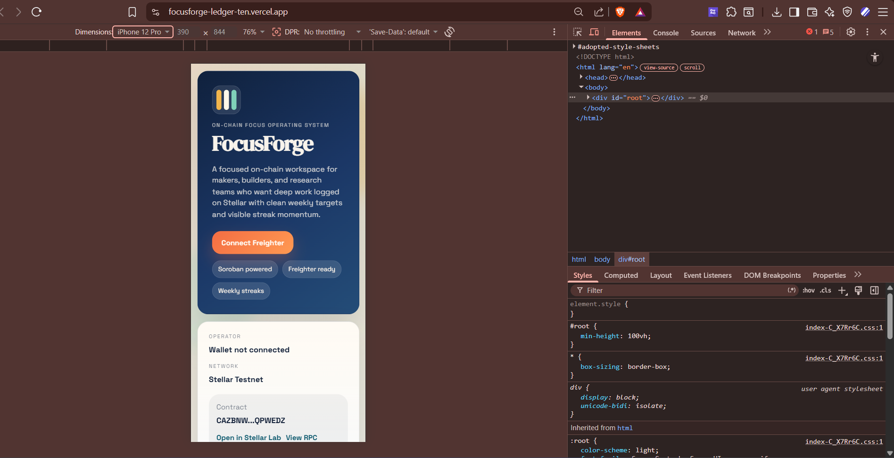
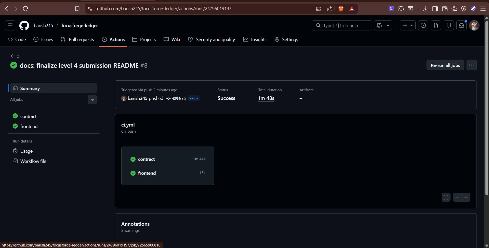

# FocusForge

[](https://github.com/barish245/focusforge-ledger/actions/workflows/ci.yml)

FocusForge is a Stellar Soroban Level 4 submission for tracking deep-work sessions on-chain. Operators connect Freighter, create a public profile, set a weekly focus target, log verified sessions, and monitor both personal progress and contract-wide activity from a responsive production frontend.

## Live Submission Links

- Public repository: `https://github.com/barish245/focusforge-ledger`
- Live demo: `https://focusforge-ledger-ten.vercel.app`
- Vercel production deployment: `https://focusforge-ledger-d00cbokkh-deep-sahas-projects-5b5ba27c.vercel.app`
- MVP video: `https://drive.google.com/file/d/1GvgDGCJqStruF6dRhULNyLi7KjuHdDUx/view?usp=sharing`

## Screenshots

### Desktop UI


### Mobile UI



### CI/CD



## Project Overview

FocusForge helps a learner or builder prove focused work on-chain. Each wallet can:

- Create or update a profile with a public display name
- Set a weekly goal in minutes
- Log deep-work sessions on Soroban
- Track total minutes, minutes this week, session count, and streak momentum
- Inspect network-wide stats for the whole contract
- Watch recent contract activity pulled from Soroban RPC

## Architecture

### Smart contract

Location: [`contracts/focus_forge/src/lib.rs`](./contracts/focus_forge/src/lib.rs)

Contract methods:

- `save_profile(learner, display_name, weekly_goal_minutes)`
- `update_weekly_goal(learner, new_goal_minutes)`
- `log_session(learner, topic, minutes_spent)`
- `get_dashboard(learner)`
- `get_global_stats()`
- `get_session_count(learner)`
- `get_session(learner, index)`
- `has_profile(learner)`

Stored contract data:

- Per-wallet learner profile
- Per-wallet session history
- Weekly progress counters
- Consecutive-day streak data
- Global contract stats across all learners and sessions

Validation rules:

- Display name: `3-32` characters
- Topic: `3-48` characters
- Session length: `5-480` minutes
- Weekly goal: `30-5000` minutes

### Frontend

Location: [`frontend/src`](./frontend/src)

Frontend stack:

- React + Vite
- TanStack Query
- Freighter wallet integration
- Soroban RPC reads and writes through `@stellar/stellar-sdk`

Frontend production upgrades in this Level 4 pass:

- live contract-wide stats panel
- recent contract event polling from Soroban RPC
- deterministic contract config export for cleaner builds
- real ESLint setup
- better mobile layout handling
- clearer contract and RPC visibility for operators

## Contract Deployment

- Network: `Stellar Testnet`
- Contract alias: `focus_forge`
- Current contract ID: `CAZBNW7LNKRGNYZVDUB4DCWSZHEFBICEJEFBY4XURGCHVNLOPLQPWEDZ`
- Contract explorer: `https://lab.stellar.org/r/testnet/contract/CAZBNW7LNKRGNYZVDUB4DCWSZHEFBICEJEFBY4XURGCHVNLOPLQPWEDZ`
- Deployment record: [`deployments/testnet.json`](./deployments/testnet.json)

Deployment transactions:

- WASM upload tx: `https://stellar.expert/explorer/testnet/tx/39ba11fc489089fd0f43d74db529efbf8e4bacf53034c56fa5ccb534098f55b4`
- Contract deploy tx: `https://stellar.expert/explorer/testnet/tx/eda5b248a64b66fe1a362742d5198e297f4d2ba5d18c1981f4850a44b4d24135`

Verification transactions used after deployment:

- Profile save tx: `https://stellar.expert/explorer/testnet/tx/cd11d3aa09d01c5439c6b86311a3c8ffca4109b2a1a7793f88d3edba59c59e43`
- Session log tx: `https://stellar.expert/explorer/testnet/tx/abe136b79a8c7c652633a430cd6a593cbbf8f87aab4ce0ad9f07e9b01e3e87d2`

## CI/CD

GitHub Actions workflow: [`ci.yml`](./.github/workflows/ci.yml)

The pipeline runs:

- `npm ci`
- `cargo fmt --all --check`
- `cargo test`
- `cargo build --target wasm32v1-none --release -p focus_forge`
- `npm run lint`
- `npm run build:frontend`

CI badge:

[](https://github.com/barish245/focusforge-ledger/actions/workflows/ci.yml)

## Local Setup

### 1. Install dependencies

```powershell
npm install
```

### 2. Run contract validation

```powershell
npm run contract:check
```

### 3. Build the frontend bundle

```powershell
npm run build:frontend
```

### 4. Start the app locally

```powershell
npm run dev
```

### 5. Optional environment file

Copy `.env.example` to `.env` if you want to override defaults:

```env
STELLAR_ACCOUNT=alice
STELLAR_NETWORK=testnet
STELLAR_CONTRACT_ALIAS=focus_forge
VITE_STELLAR_RPC_URL=https://soroban-testnet.stellar.org
VITE_STELLAR_NETWORK_PASSPHRASE=Test SDF Network ; September 2015
VITE_CONTRACT_ID=CAZBNW7LNKRGNYZVDUB4DCWSZHEFBICEJEFBY4XURGCHVNLOPLQPWEDZ
```

## Build, Test, and Deploy Commands

### Contract build

```powershell
npm run contract:build
```

### Contract deploy

```powershell
$env:STELLAR_ACCOUNT='alice'
$env:STELLAR_NETWORK='testnet'
$env:STELLAR_CONTRACT_ALIAS='focus_forge'
npm run contract:deploy
```

### Export frontend config from the deployment record

```powershell
npm run export:frontend
```

### Frontend production build

```powershell
npm run build:frontend
```

### Vercel production deploy

```powershell
npx --yes --package vercel vercel deploy --prod --yes --logs
```

## Verification Steps

### Contract verification

```powershell
stellar contract invoke --id CAZBNW7LNKRGNYZVDUB4DCWSZHEFBICEJEFBY4XURGCHVNLOPLQPWEDZ --source-account alice --network testnet -- get_global_stats
stellar contract invoke --id CAZBNW7LNKRGNYZVDUB4DCWSZHEFBICEJEFBY4XURGCHVNLOPLQPWEDZ --source-account alice --network testnet -- get_dashboard --learner GAOIB7NPO2XP5AM3OXTQL3FR5WA444UPISMYZ2VZGOSGNGICSBWWO3MM
```

### Frontend verification

1. Open the live demo.
2. Confirm the contract snapshot shows the current testnet contract ID.
3. Connect Freighter on Stellar Testnet.
4. Save a profile or log a session.
5. Confirm the transaction link opens in Stellar Expert.
6. Confirm the recent contract activity panel refreshes with new events.

## Inter-contract Calls and Token/Pool Notes

- Inter-contract calls: `Not used in this project`
- Transaction hashes for inter-contract calls: `Not applicable`
- Custom token deployed: `No`
- Liquidity pool deployed: `No`
- Token or pool address: `Not applicable`

This submission was strengthened with richer on-chain UX and live contract activity instead of adding a token or pool that the product does not need.

## Submission Checklist

- Public GitHub repository: `Yes`
- Complete README: `Yes`
- Live demo link included: `Yes`
- Mobile responsive screenshot included: `Yes`
- CI badge included: `Yes`
- Contract address documented: `Yes`
- Deployment transaction hashes documented: `Yes`
- Inter-contract call note included: `Yes`
- Token/pool note included: `Yes`
- Live frontend deployed: `Yes`
